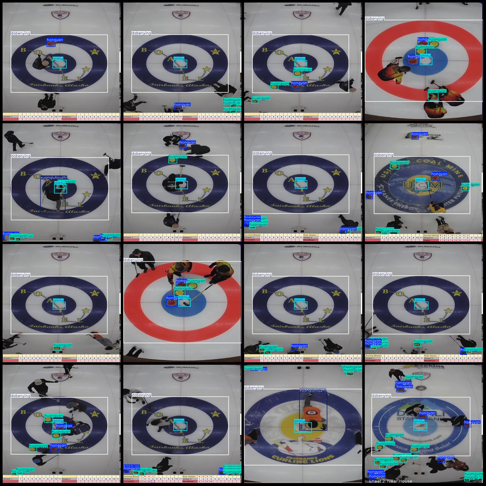
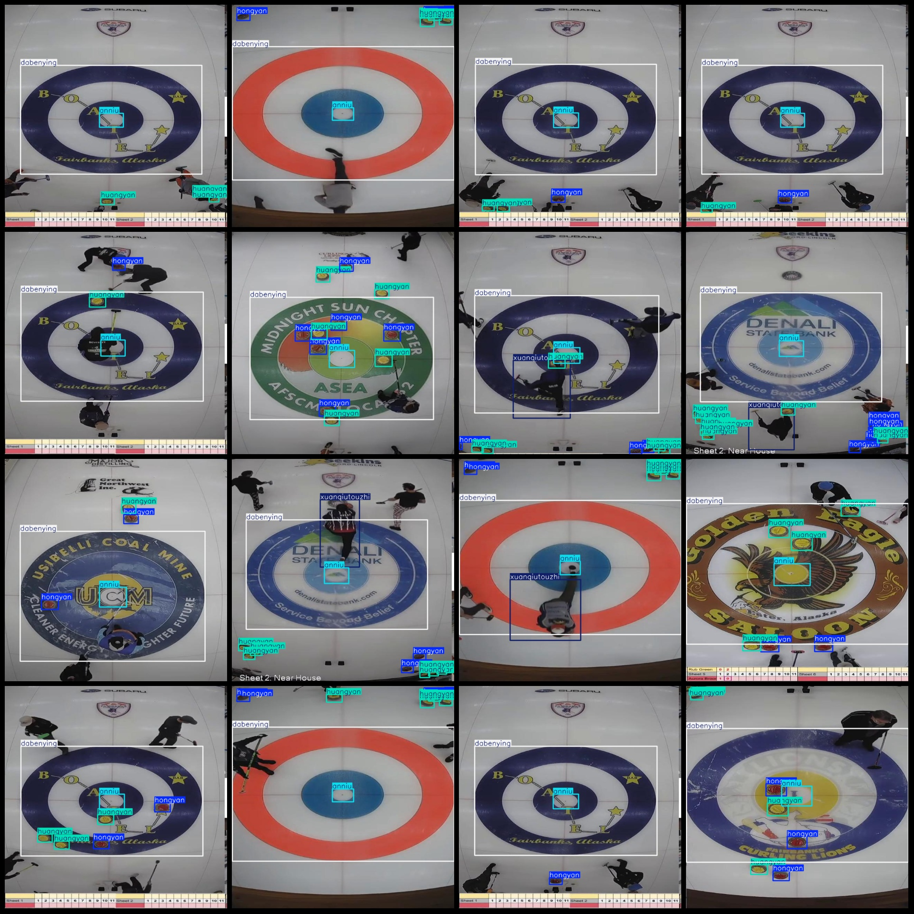

# Icy Hockey Detection Dataset (VOC+YOLO) with 2339 Images and 5 Categories

Dataset format: Pascal VOC format + YOLO format (txt files without split paths, only containing jpg images along with their corresponding VOC-format xml files and YOLO-format txt files).
Number of images (jpg file count): 2339
Number of annotations (xml file count): 2339
Number of annotations (txt file count): 2339
Number of categories: 5
Annotation category names (note that the yolo-format category order does not correspond to this, but is based on the labels folder's classes.txt): ["anniu", "dabenying", "hongyan", "huangyan", 
"xuanqiutouzhi"]
["Button", "Base Camp", "Red Rock", "Yellow Rock", "Spinning Throw"]
Button (the central point of the icy hockey's base area, i.e., the "heart")
Spinning ball throw (the ice hockey's throwing action/throwing technique)
Base area (the target zone in the ice hockey match, i.e., the scoring circle)
Red rock (red icy hockey stone)
Yellow rock (yellow icy hockey stone)
Number of bounding boxes per category:
anniu = 2386
dabenying = 2452
hongyan = 6096
huangyan = 7149
xuanqiutouzhi = 455
Total bounding boxes: 18538
Number of pictures per category:
anniu = 2336
dabenying = 2337
hongyan = 1944
huangyan = 2037
xuanqiutouzhi = 454
Image resolution: 640x640
Annotation tool used: labelImg
Annotation rules: Draw a rectangular bounding box for each category
Important note: The dataset does not have a division into training, validation, and test sets; users are required to partition it themselves.
Special declaration: This dataset does not guarantee the accuracy of the trained models or weight files.
Image preview:
## Images

Here is a pay link on Stripe ( https://buy.stripe.com/3cs8yP7sY87d0vu9AB ). Please contact me lonlonago@foxmail.com after funding $89, and I will send you a complete data files , thank you!

